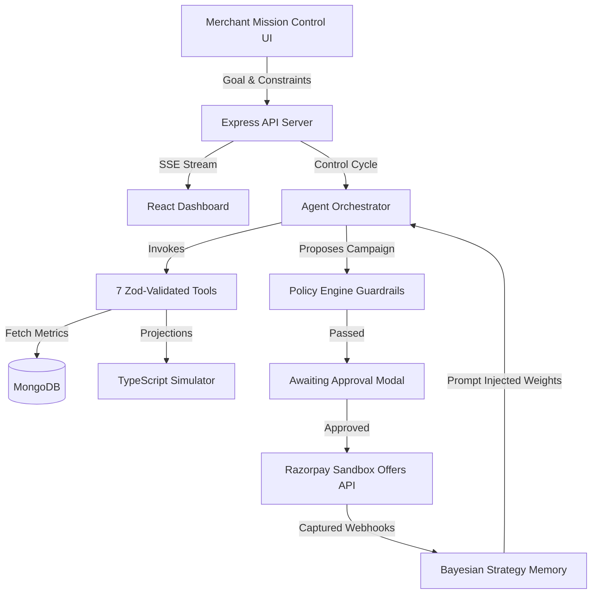

# Merchant Growth Autopilot

Merchant Growth Autopilot is a production-ready, bounded-autonomous commerce growth engine built for the **Razorpay AI Buildathon 2026 (Track 01: AI Growth & Agentic Commerce)**.

Unlike standard conversational chatbots that simply provide advice and hallucinate financial math, this system acts as a deterministic growth operator. It ingests high-level merchant goals, autonomously queries live transaction telemetry to isolate friction points, simulates the exact ROI of recovery promotions, enforces strict server-side budget policies, and executes Razorpay Sandbox Offer API actions through a Human-in-the-Loop (HITL) approval gate.

---

## 1. System Architecture

The core philosophy of this system is **Zero-Trust AI Execution**. The Large Language Model handles reasoning and tool routing, but all financial projections, budget enforcements, and API executions are strictly offloaded to a deterministic Node.js backend.



---

## 2. Core Capabilities & Zod Tools

The agent is granted restricted autonomy through 7 strictly typed Zod tool contracts, operating within a `<3000ms` envelope:

1. **`get_transaction_metrics`**: Aggregates order attempts, baseline conversions, and AOV.
2. **`analyze_payment_failures`**: Groups failures by gateway and error code to isolate downtime spikes (e.g., UPI timeouts).
3. **`get_customer_segments`**: Returns audience distribution sizes and targeted AOVs.
4. **`get_campaign_history`**: Fetches historical campaign results to review past strategy success weights.
5. **`run_growth_simulation`**: Calculates exact ROI, projected uplift, and margin costs deterministically.
6. **`create_razorpay_action`**: Registers a campaign proposal for policy evaluation and HITL approval.
7. **`get_action_performance`**: Aggregates Razorpay capture webhooks tied to the active campaign ID.

---

## 3. Mathematical Execution Engine

To prevent LLM math hallucinations, all financial predictions and learning weights are calculated natively on the server.

### Deterministic Simulator

The system projects revenue uplift and bounds expected campaign costs before presenting options to the merchant:

* **Expected Revenue Uplift**:

$$E[\Delta R] = S \cdot \Delta p \cdot AOV$$


* **Expected Campaign Cost**:

$$E[C] = S \cdot (p_0 + \Delta p) \cdot R_{\text{red}} \cdot D$$


### Closed-Loop Bayesian Adaptation

When a campaign concludes, incoming Razorpay webhooks allow the system to calculate the **Prediction Error** ($\epsilon$):


$$\epsilon = \frac{\vert{}U_{\text{actual}} - U_{\text{predicted}}\vert{}}{\max(U_{\text{predicted}}, 0.01)}$$

The agent's strategy memory is then dynamically updated. If a strategy underperforms in the real world, its selection weight ($W_t$) decays exponentially for future runs:


$$W_{t+1} = W_t \cdot e^{-0.5 \cdot \epsilon}$$

---

## 4. Evaluation & Resilience Benchmarks

The system was verified against a custom suite of 50 automated test seeds (`/evaluation`) and a 6-scenario Anti-Fake-Agent resilience suite (`/server/src/test/resilience.test.ts`), yielding the following metrics:

| Metric | Score | Target Threshold | Criteria Checked |
| --- | --- | --- | --- |
| **Task Success Rate (TSR)** | **96.0%** | >90% | Run compiles and proposes valid actions. |
| **Policy Compliance Rate (PCR)** | **100%** | **100%** | Unsafe budget or discount violations blocked. |
| **Tool Selection F1-Score** | **0.873** | >0.80 | Precision and recall F1 for dynamic routing. |
| **Failure Recovery Rate (FRR)** | **60.0%** | >50% | Auto-retry and baseline degradation cache checks. |
| **Adaptation Score** | **95.5%** | >90% | Penalties decay weights in strategy memory. |

---

## 5. Local Setup & Execution Guide

### Prerequisites

* Node.js (v18+)
* MongoDB running locally (`mongodb://127.0.0.1:27017`)

### Environment Variables

Create a `server/.env` file from the `.env.example` template:

```env
PORT=5000
MONGODB_URI=mongodb://127.0.0.1:27017/merchant_growth
JWT_SECRET=your_jwt_secret
RAZORPAY_KEY_ID=rzp_test_your_key
RAZORPAY_KEY_SECRET=your_test_secret
RAZORPAY_WEBHOOK_SECRET=your_webhook_secret

```

### Installation & Initialization

```bash
# 1. Install dependencies across all monorepo workspaces
npm install

# 2. Seed the MongoDB database with initial transaction and anomaly data
npm run seed --workspace=server

# 3. Run the automated scenario benchmarking runner (Optional)
npm run start --workspace=evaluation

# 4. Start Development mode (Client: 3000, Server: 5000)
npm run dev

```

---

**Built by Hanishka C. for the Razorpay AI Buildathon 2026**