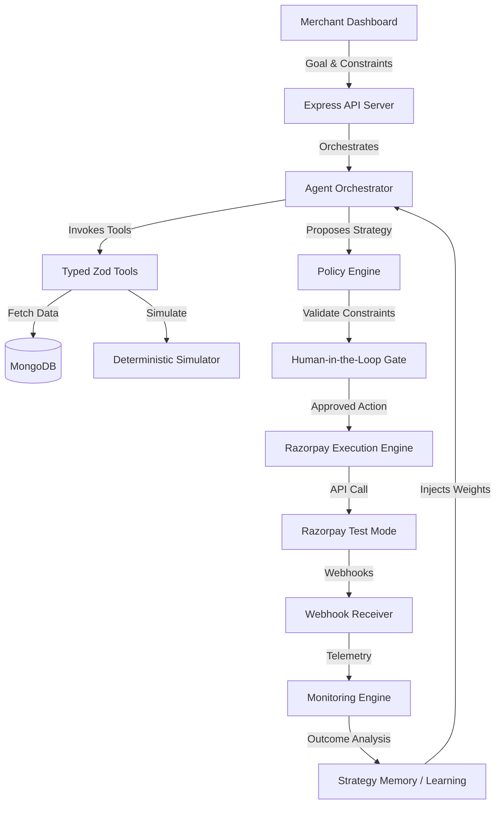

# Implementation Plan: Merchant Growth Autopilot

## 1. Product Overview
Merchant Growth Autopilot is an agentic growth-operator system designed for e-commerce merchants. Instead of acting as a conversational chatbot that simply provides advice, this system operates with bounded autonomy. It ingests high-level business goals (e.g., "Increase successful payments by 10% while keeping promotional spend under ₹50,000"), autonomously investigates merchant data, simulates strategies, checks policy compliance, requests human-in-the-loop approval, executes API actions in Razorpay test mode, monitors post-execution telemetry, and learns from outcomes via closed-loop Bayesian weight adjustments.

## 2. Problem Statement
E-commerce merchants lose substantial revenue due to payment failures, checkout drop-offs, and underperforming marketing campaigns. Identifying the root causes of these losses requires parsing voluminous transaction logs, cross-referencing bank gateway down-times, and analyzing customer cohorts. Most merchants lack the data engineering capabilities to do this in real time. Standard advice systems provide generic, non-actionable suggestions, while automated systems pose significant financial and operational risk if allowed to run without policies or human approval.

## 3. Target User
Small-to-medium enterprise (SME) e-commerce merchants using Razorpay for payments who want to maximize order conversion, recover failed checkouts, and execute targeted growth campaigns without hiring dedicated data analysis teams.

## 4. Why the Problem Matters
Payment gateway failures (especially UPI gateway timeouts) account for up to 15-20% of cart abandonment in India. A system that can automatically identify HDFC or SBI bank downtime, isolate the affected cohort, calculate the ROI of switching incentives, and immediately launch a fallback card-payment discount campaign or recovery payment link can save thousands of rupees in lost revenue daily.

## 5. Product Goals
- Establish a closed-loop agentic growth system that observes, reasons, simulates, executes, and adapts.
- Maintain strict deterministic boundaries: LLM does reasoning/tool selection; Node.js backend handles money, policies, database isolation, and calculations.
- Achieve 100% compliance with merchant policies (e.g., spending limits).
- Provide full audibility and real-time execution tracing via Server-Sent Events (SSE).

## 6. User Journey
1. **Goal Input**: Merchant defines a measurable goal and constraints (metric, target percentage, timeframe, budget cap) on the Mission Control UI.
2. **Investigation**: The agent stream displays tool execution traces in real time as it queries transactions, failures, customer segments, and campaign histories.
3. **Diagnosis & Simulation**: The agent presents a root-cause diagnosis and a comparative matrix of 2-3 simulated strategies with ROI and confidence bounds.
4. **Approval Gate**: The merchant reviews the policy badges and simulated outcomes, then clicks "Approve".
5. **Execution & Monitoring**: The system executes the campaign using Razorpay test-mode APIs (Offers / Payment Links), tracks transactions via webhook, calculates prediction errors, and updates strategy memory weights.

## 7. Core Use Cases
- **UPI Anomaly Recovery**: Detect HDFC/SBI UPI gateway timeout spikes, isolate affected high-value customers, and create an offer to incentivize card/NetBanking checkouts.
- **Cart Value Boost**: Target returning customers with order values just below average and offer a tiered discount code via Razorpay Offers to increase average order value.
- **Cart Recovery**: Generate targeted Razorpay Payment Links with custom discounts for users who experienced failed transactions.

## 8. Functional Requirements
- High-level goal parsing into structured JSON constraints.
- Real-time agent status and decision-evidence-action loop streaming.
- Deterministic Node.js Simulator.
- Hard server-side Policy Enforcement Engine.
- Human-in-the-Loop (HITL) approval dashboard.
- Razorpay test-mode API integration (Offers, Payment Links).
- Webhook endpoints for order and payment telemetry.
- Closed-loop Bayesian strategy-weight updates.
- Automated evaluation runner for 50 scenarios.

## 9. Non-Functional Requirements
- **Tenant Isolation**: Every database query must filter by `merchantId`.
- **Latency**: Tool executions must timeout under 3000ms.
- **Explainability**: Internal reasoning must be parsed into user-friendly summaries.
- **Resilience**: API or tool failure must trigger exponential retries and fallback to cache.

## 10. System Architecture
The system is architected as a modular TypeScript monorepo containing three core packages:
- **`client/`**: React 18 frontend dashboard.
- **`server/`**: Express server handling API, agent loop, simulator, policy engine, and execution.
- **`evaluation/`**: Autonomous benchmarking suite running 50 deterministic scenarios.



## 11. Frontend Architecture
Built with React 18, Vite, TypeScript, Tailwind CSS, Lucide Icons, and Recharts. The layout utilizes a single-screen dashboard representing "Mission Control". It features:
- Goal Configuration panel.
- Agent Stream (SSE-driven timeline of Decision-Evidence-Action nodes).
- Collapse-enabled Tool execution payload inspectors.
- Root Cause Diagnosis card.
- Strategy Comparison Matrix (interactive cards).
- Policy validation logs.
- Approval Modal.
- Live Telemetry curves.
- Learning weight-adaptation timeline.
- Benchmark Dashboard.

## 12. Backend Architecture
Written in Node.js and TypeScript using Express. Structured into isolated components:
- `routes/`: Express endpoint mappings.
- `agent/`: State-machine orchestrator using native Gemini/OpenAI SDK tool-calling.
- `tools/`: Independent modules implementing tool functions with Zod validators.
- `simulator/`: Pure functions implementing growth equations.
- `policy/`: Middleware and engine to run rule validation on proposed actions.
- `razorpay/`: Razorpay Node SDK client wrapper.
- `monitoring/`: Telemetry processing and webhook routing.
- `learning/`: Strategy Memory MongoDB repository and weight adjustment algorithms.
- `models/`: Mongoose schemas.

## 13. Agent Architecture
A state machine driven by a native LLM client. The agent is initialized with a system prompt detailing the available tools and rules. It consumes the current Goal and Constraints, queries Strategy Memory for weight historical data, and iterates:
`PLAN` -> `SELECT TOOL` -> `EXECUTE` -> `OBSERVE` -> `DIAGNOSE` -> `SIMULATE` -> `PROPOSE`.
The agent does not hardcode sequences; tool paths change dynamically based on the scenario seed, budget constraints, and current telemetry.

## 14. Tool Architecture
All tools are defined as objects containing:
1. `name`: string identifier.
2. `description`: business utility summary for the LLM.
3. `inputSchema`: Zod schema for input validation.
4. `outputSchema`: Zod schema for output formatting.
5. `execute(merchantId, args)`: Async function wrapped in a 3000ms timeout promise and retry handler.

## 15. Database Architecture
Mongoose-backed MongoDB schema. All models inherit or enforce a strict `merchantId` index.
- `merchants`: Details and API configurations.
- `transactions`: Log of attempts, successes, failures, payment methods, bank gateway identifiers.
- `customers`: Profiles and cohort segments.
- `products`: Catalog items and order limits.
- `campaigns`: Active and completed promotions.
- `agent_runs`: Audit trail of execution traces.
- `approvals`: State logs of HITL actions.
- `policies`: Editable rule sets.
- `executions`: Record of Razorpay test API outcomes.
- `strategy_memory`: Storage of strategy performance and weights.
- `evaluation_results`: Aggregated scores of automated runs.

## 16. Policy Engine
A deterministic backend validator that evaluates any proposed actions. The engine is loaded with parameters (e.g., max discount, max budget) from the database and returns a structured output:
```typescript
interface PolicyResult {
  passed: boolean;
  violations: string[];
  rulesChecked: { ruleName: string; status: 'PASSED' | 'FAILED'; value: any; limit: any }[];
}
```
If `passed` is false, the action is blocked server-side, preventing database persistence or API execution, and reporting the structural block back to the agent.

## 17. Growth Simulator
A mathematical modeling engine that predicts campaign outcomes using deterministic formulas:
- **Uplift**: \(E[\Delta R] = S \times \Delta p \times AOV\)
- **Cost**: \(E[C] = S \times (p_0 + \Delta p) \times R_{red} \times D\)
- **Margin**: Net profit must exceed budget floor constraints.
- **Uncertainty**: 95% Confidence Interval is calculated dynamically to penalize small sample segments.

## 18. Human Approval System
Protects the merchant's live state. When the agent is ready to execute a policy-passing action, it creates an approval record with a status of `pending`. The backend emits an SSE event causing the Mission Control UI to display a modal containing:
- Specific action type (e.g., `create_offer`).
- Targeted customer cohort and segment size.
- Exact discount percentage or coupon structure.
- Calculated cost, expected revenue, and ROI.
- Policy check results.
The merchant must explicitly click Approve (which moves the status to `approved` and triggers execution) or Reject.

## 19. Execution System
Executes approved campaigns using Razorpay's test-mode APIs. If the action is a discount offer, it creates an offer via the Razorpay Offers API (`POST /v1/offers`). If it is a checkout recovery action, it generates a payment link via the Razorpay Payment Links API (`POST /v1/payment_links`). For marketing actions not supported by Razorpay (e.g., email notification), the backend runs a controlled database-level application simulation, flagging the execution as `simulated_action: true`.

## 20. Monitoring System
Runs post-execution telemetry aggregation. An active campaign's performance is analyzed by comparing incoming transaction records (using webhook events or query filters) against the historical baseline. It measures:
- Target conversion uplift.
- Spend trajectory.
- Prediction error.

## 21. Learning/Adaptation System
Implements a feedback loop targeting future runs. Strategy performance is persisted in the `strategy_memory` collection. Future agent queries fetch historical weight multipliers and append them to the prompt context.
- **Prediction Error (\(\epsilon\))**:
  \[\epsilon = \frac{|U_{actual} - U_{pred}|}{\max(U_{pred}, 0.01)}\]
- **Weight Decays**:
  If Actual < Predicted (underperformed):
  \[W_{t+1} = W_t \times e^{-0.5 \cdot \epsilon}\]
  If Actual >= Predicted (overperformed):
  \[W_{t+1} = W_t \times (1 + \min(0.2, 0.05 \times ROI))\]
This ensures underperforming strategies are heavily penalized and successful ones are promoted.

## 22. Failure Recovery
Handles execution faults gracefully using a standardized retry-and-degradation matrix:
- Tool execution errors trigger up to 2 immediate retries.
- On persistent third-party failure, tools fallback to cached static merchant baselines.
- The confidence score of the strategy is penalized (reduced by a factor of 0.8), and the UI displays a clear degradation warning badge.

## 23. Audit Trail
Every agent execution registers a unique execution run ID. The backend writes step logs to the `agent_runs` collection, detailing:
- Starting goal and constraints.
- Sequential tool invocations, input parameters, and output results.
- Simulated strategies and prediction metrics.
- Policy validation state.
- Human approval decisions.
- Razorpay API payloads and response structures.
- Weight updates.
This creates a chronological, verifiable audit log.

## 24. Evaluation Framework
An automated module running in the `/evaluation` directory. It contains 50 distinct test scenario files (JSON representations of database states, gateway issues, and constraints) and an execution runner. The engine measures:
- Task completion rates.
- Tool selection F1 score.
- Zod contract validity.
- Budget constraint compliance.
- 100% policy enforcement.
- Adaptive performance (running scenario iterations to verify that weight decays successfully shift strategy selection).

## 25. Testing Strategy
- Unit tests for Simulator mathematical formulas.
- Validation checks for Zod schemas.
- Integration tests checking the Policy Engine blocks invalid discount parameters.
- E2E tests for the 6 anti-fake-agent challenges (Tool Removal, Tool Reordering, Goal Change, New Scenario, Failure Injection, Constraint Change).

## 26. Security Model
- JWT authorization on Express API endpoints.
- Strict tenant filtering (`merchantId` injected programmatically on Mongoose models).
- Deterministic policy enforcement strictly server-side (preventing LLM parameter tampering).
- Verification of incoming webhook signatures using HMAC-SHA256.

## 27. Razorpay Test-Mode Integration
Integrates with Razorpay Sandbox credentials. No production actions are ever executed. It creates genuine Test Mode objects:
- **Offers API**: Validates discount parameters, binds them to target card/UPI methods, and registers them.
- **Payment Links API**: Generates functional sandbox links for cart recovery.

## 28. API Contracts
Detailed endpoints mapping in the system architecture documents. Primary routes:
- `POST /api/goals`: Submit a goal.
- `GET /api/runs/:runId/stream`: Listen to SSE event trace.
- `POST /api/approvals/:approvalId`: Approve or reject action.
- `GET /api/monitoring`: Retrieve live telemetry.
- `GET /api/evaluation/metrics`: Fetch evaluation benchmark reports.

## 29. Database Schema
Defined in [`docs/architecture/DATABASE_SCHEMA.md`](file:///C:/Users/DELL/.gemini/antigravity/scratch/merchant-growth-autopilot/docs/architecture/DATABASE_SCHEMA.md). Enforces Mongoose typing and indexing on `merchantId` and timestamps.

## 30. Tool Schemas
Zod-validated object definitions mapped in [`docs/architecture/TOOL_SCHEMAS.md`](file:///C:/Users/DELL/.gemini/antigravity/scratch/merchant-growth-autopilot/docs/architecture/TOOL_SCHEMAS.md). Ensures exact validation before executing handlers.

## 31. Agent State Machine
Detailed state machine diagram and transition rules in [`docs/architecture/AGENT_STATE_MACHINE.md`](file:///C:/Users/DELL/.gemini/antigravity/scratch/merchant-growth-autopilot/docs/architecture/AGENT_STATE_MACHINE.md). Defines paths: `IDLE` -> `INVESTIGATING` -> `DIAGNOSING` -> `SIMULATING` -> `VALIDATING` -> `AWAITING_APPROVAL` -> `EXECUTING` -> `MONITORING` -> `ADAPTING`.

## 32. Folder Structure
```
merchant-growth-autopilot/
├── client/                  # Vite + React + TypeScript App
│   ├── src/
│   │   ├── components/      # UI Dashboard cards & graphs
│   │   ├── hooks/           # custom SSE hooks
│   │   └── App.tsx
├── server/                  # Express + Node.js API
│   ├── src/
│   │   ├── agent/           # LLM agent engine
│   │   ├── tools/           # Zod schema tools
│   │   ├── simulator/       # Growth simulations
│   │   ├── policy/          # Policy validator
│   │   ├── monitoring/      # Webhooks & telemetry
│   │   ├── learning/        # strategy weights
│   │   ├── models/          # MongoDB schemas
│   │   └── index.ts         # entry point
├── evaluation/              # 50 scenarios suite
│   ├── scenarios/           # scenario JSON definitions
│   ├── runner.ts            # runs the suite
│   └── metrics.ts           # evaluates results
├── docs/                    # Docs and Specs
│   ├── IMPLEMENTATION_PLAN.md
│   └── architecture/        # Spec documents
```

## 33. Environment Variables
Stored in a `.env` file (never checked into source control):
```env
PORT=5000
MONGODB_URI=mongodb://localhost:27017/merchant_growth
JWT_SECRET=your_jwt_secret_here
GEMINI_API_KEY=your_gemini_api_key_here
RAZORPAY_KEY_ID=rzp_test_yourkeyid
RAZORPAY_KEY_SECRET=yourkeysecret
RAZORPAY_WEBHOOK_SECRET=yourwebhooksecret
```

## 34. Deployment Strategy
- **Frontend**: Deployed on Vercel or Netlify.
- **Backend**: Containerized via Docker and deployed on Render, Heroku, or AWS ECS.
- **Database**: MongoDB Atlas cloud cluster.
- **Razorpay**: Sandbox credentials configured in production env vars.

## 35. Demo Scenario
The primary demo executes the classic gateway timeout case:
1. Goal: "Increase successful payments by 10% in 30 days while spending < ₹50,000."
2. The agent queries transactions, detects SBI/HDFC UPI gateway success drop from 90% to 40%.
3. Customer segments identified: High-value active customers (order > ₹1,000) using UPI.
4. Agent generates strategies: Strategy A (Offers discount on Cards/NetBanking fallback), Strategy B (Payment Link retry).
5. Simulator calculates Strategy A expected uplift +8.2%, cost ₹32,000, ROI 1.5; Strategy B uplift +4.5%, cost ₹0, ROI infinite.
6. Policy check approves Strategy A (₹32k under ₹50k cap).
7. Merchant approves Strategy A in UI.
8. System calls Razorpay API to create Offer `promo_card_fallback`.
9. Outcome telemetry simulated: actual uplift +7.5% at cost ₹31,500.
10. Prediction error calculated and weight adjusted.

## 36. 5-Minute Demo Plan
- **0:00 - 0:30**: Input goal & constraints on Mission Control dashboard.
- **0:30 - 1:30**: Watch the Agent stream tool invocations, showing the HDFC UPI failure spike.
- **1:30 - 2:30**: Inspect the Simulator card comparing Card Fallback vs Payment Recovery.
- **2:30 - 3:30**: Approve Card Fallback, observe the Razorpay Test Mode API output.
- **3:30 - 4:15**: Trigger deliberate tool timeout, watch the agent retry and recover.
- **4:15 - 4:45**: Review the post-execution telemetry curve and Bayesian memory update.
- **4:45 - 5:00**: Open the Benchmark dashboard showing metrics from 50 simulated scenario runs.

## 37. Implementation Milestones
1. **Milestone 1**: Set up monorepo structures, databases, and mock telemetry. (Week 1, Days 1-2)
2. **Milestone 2**: Write core Tools (Zod validator) and Simulator engine. (Week 1, Days 3-4)
3. **Milestone 3**: Build Agent State Machine and SSE output streams. (Week 1, Days 5-6)
4. **Milestone 4**: Policy Engine, HITL approval, and Razorpay API wrappers. (Week 2, Days 1-2)
5. **Milestone 5**: Monitoring pipeline, learning loops, and Strategy Memory. (Week 2, Days 3-4)
6. **Milestone 6**: Build 50 evaluation scenarios and runner engine. (Week 2, Day 5)
7. **Milestone 7**: Mission Control UI implementation and polishing. (Week 2, Days 6-7)

## 38. Definition of Done
- Complete test coverage for the 6 anti-fake-agent challenges.
- All 50 evaluation scenarios execute and generate real scores.
- Policy compliance is 100% blocked on violations.
- API is strictly tenant-isolated.
- Razorpay Sandbox actions create real resources.
- UI displays the end-to-end SSE stream, simulator, approval modal, and learning weight cards.

## 39. Risks
- **API Key Expiry**: Sandbox credentials expired on buildathon demo day. *Mitigation: Auto-fallback mock client when API returns auth error.*
- **LLM Hallucinations**: Prompt injection or invalid tool parameters. *Mitigation: Hard backend schema validation and Policy Engine guards.*

## 40. Known Limitations
- The simulation is deterministic and based on historical models; it cannot predict black swan macro events.
- Razorpay Offers API only runs in test-mode sandbox limits.

## 41. Explicitly Out-of-Scope Features
- Automatic live budget increases without human authorization.
- Marketing execution via external SMS/Email gateways.
- Multi-currency currency-conversion optimization.
