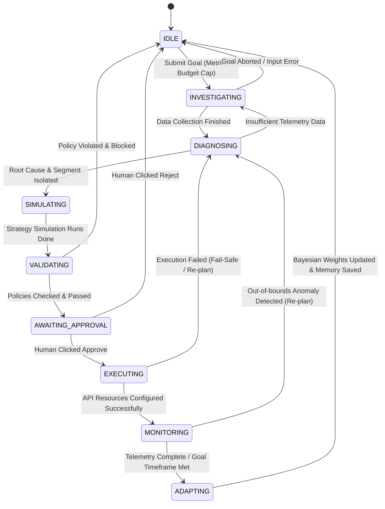

# Agent State Machine: Merchant Growth Autopilot

This document defines the state transitions, triggers, and cognitive workflows of the Agent.

## 1. State Chart Overview
The Agent operates as an event-driven state machine. All transitions are persisted in MongoDB to allow audits, fail-safes, and warm restarts.

---

## 2. Detailed State Specifications

### 2.1 IDLE
- **Description**: Agent is resting, awaiting user configuration.
- **Entry Actions**: Clear current goal context, reset transaction buffers.
- **Exit Actions**: Parse goal inputs, validate budget constraints, pull Strategy Memory history.

### 2.2 INVESTIGATING
- **Description**: Agent queries historical payment records and logs.
- **Tools Called**: `get_transaction_metrics`, `analyze_payment_failures`.
- **Transitions**:
  - Success -> `DIAGNOSING` when transaction volume counts and failure maps are successfully built.
  - Fail -> `IDLE` if input variables are mismatched or target bounds are out of operational range.

### 2.3 DIAGNOSING
- **Description**: Agent executes cognitive parsing of evidence to locate business vulnerabilities.
- **Tools Called**: `get_customer_segments`, `get_campaign_history`.
- **Transitions**:
  - Success -> `SIMULATING` once a target segment is mapped and historical control weights are retrieved.
  - Insufficient Data -> `INVESTIGATING` if baseline sample size is too low.

### 2.4 SIMULATING
- **Description**: Proposes alternative strategies and routes parameter sets to the Simulator.
- **Tools Called**: `run_growth_simulation`.
- **Transitions**:
  - Success -> `VALIDATING` after simulator outputs net profit impacts, ROI, and confidence ranges.

### 2.5 VALIDATING
- **Description**: Runs proposed payloads through the Policy Engine middleware.
- **Server Enforcement**: Checks against caps (discount ceiling, margin floors, budget caps).
- **Transitions**:
  - Validated -> `AWAITING_APPROVAL` if all policies evaluate as `PASSED`.
  - Blocked -> `IDLE` (or auto-replan to `SIMULATING` with adjusted parameters) if any check evaluations result in `FAILED`.

### 2.6 AWAITING_APPROVAL
- **Description**: Pauses agent control loop; writes approval record to DB and alerts client.
- **Triggers**:
  - `POST /api/approvals/:approvalId` with status `approved` -> `EXECUTING`.
  - `POST /api/approvals/:approvalId` with status `rejected` -> `IDLE`.

### 2.7 EXECUTING
- **Description**: Backend executes API requests in Razorpay test mode or controlled simulation environment.
- **Tools Called**: `create_razorpay_action`.
- **Transitions**:
  - Success -> `MONITORING` after receiving action IDs and setup timestamps.
  - Fail -> `DIAGNOSING` if API returns error status (initiates retry/backoff degradation).

### 2.8 MONITORING
- **Description**: Pulls webhook outputs or queries transaction logs post-launch.
- **Tools Called**: `get_action_performance`.
- **Transitions**:
  - Timeframe Expired -> `ADAPTING`.
  - Severe Telemetry Anomaly (e.g. unexpected budget exhaust) -> `DIAGNOSING` (re-plan).

### 2.9 ADAPTING
- **Description**: Calculates final ROI and prediction errors, decays strategy weights.
- **Actions**: Writes adjustments to `strategy_memory` MongoDB.
- **Transitions**: Complete -> `IDLE`.
