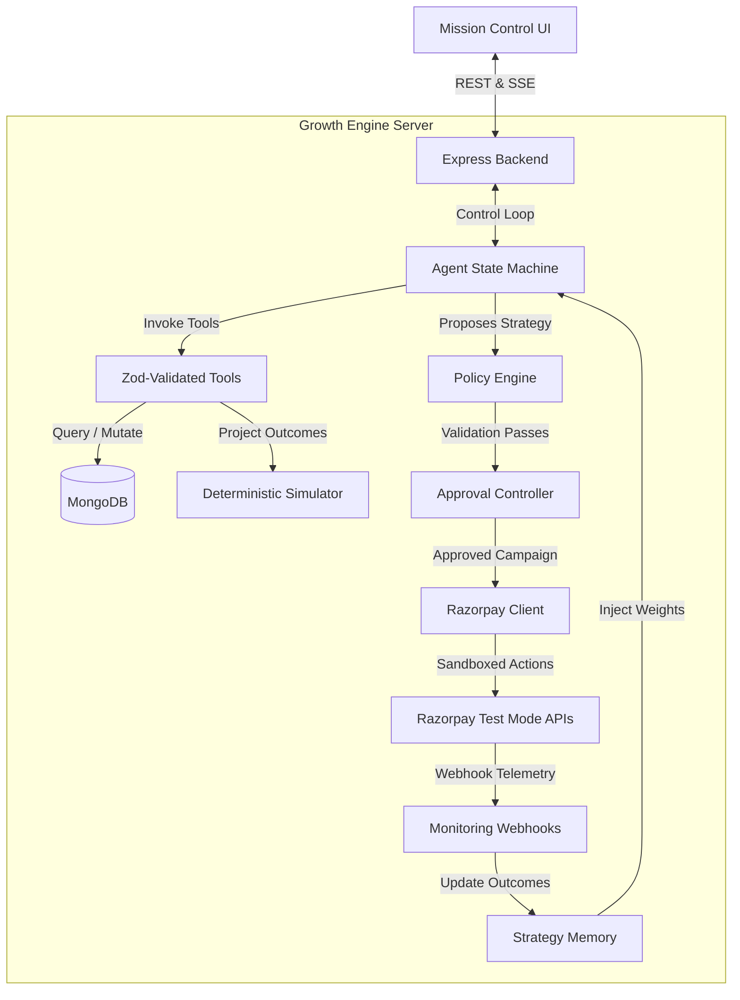
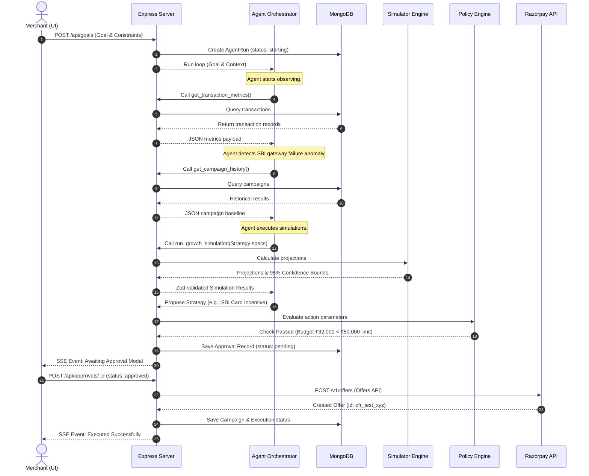

# System Architecture: Merchant Growth Autopilot

This document defines the high-level architecture, module boundaries, component responsibilities, and data flows of the Merchant Growth Autopilot system.

## 1. Core Principles
1. **Strict Separation of Concerns**: 
   - The LLM Agent functions purely as a cognitive reasoning layer (interpreting goals, selecting tools, performing business diagnoses, and proposing actions).
   - The Node.js Backend functions as the deterministic execution, authorization, validation, and enforcement layer. The LLM has no capability to execute actions directly or bypass security policies.
2. **Deterministic Simulation & Policy Verification**: 
   - Projections of cost, uplift, ROI, and confidence bounds are evaluated mathematically in TypeScript by the Simulator.
   - All proposed actions must pass through a strict Policy Engine on the server before reaching the human approval queue.
3. **Traceability and Auditability**: 
   - Every state transition, tool execution, policy check, simulation run, approval request, and outcome is logged chronologically under a specific Goal Run.

## 2. Component Layout

The system is organized into a modular monorepo:
- **Mission Control UI (`/client`)**: React 18, Tailwind CSS dashboard. Connects via Server-Sent Events (SSE) for agent traces and standard REST for mutations.
- **Growth Engine Server (`/server`)**: Express API that exposes endpoints, runs the agent loop, drives tool execution, hosts the simulator, runs policies, connects to MongoDB, and triggers Razorpay APIs.
- **Evaluation Runner (`/evaluation`)**: Benchmarking engine running 50 deterministic scenarios to output performance and safety metrics.

## 3. Component Responsibilities

### 3.1 Mission Control UI (Frontend)
- **Goal Configurator**: User-friendly form inputs for metric targets, budget cap, timeline, and scenario seeds.
- **Orchestration Log**: An interactive stream displaying active agent trace nodes (Decision, Evidence, Action).
- **Strategy Matrix**: Renders alternative strategies side-by-side with charts showing expected vs worst-case bounds.
- **Approval Gateway**: Interactive modal with detailed action specifications and validation status.
- **Adaptation Map**: Visual timeline showing historical Bayesian weight modifiers and prediction errors over time.
- **Benchmarking Panel**: Renders aggregated statistics from the 50 scenarios.

### 3.2 Agent Orchestrator (Backend Cognitive Layer)
- Translates unstructured goals into operational constraints.
- Analyzes current database state using available tools.
- Formulates diagnoses (e.g., Identifying gateway failure patterns).
- Selects strategies to simulate.
- Evaluates simulation outputs and decides on a proposal.
- Uses past performance weight vectors from Strategy Memory to penalize or prioritize strategies.

### 3.3 Simulator (Backend Math Engine)
- Computes deterministic expected conversion, campaign cost, and gross margin impact.
- Calculates 95% confidence intervals based on target segment sample sizes.
- Ensures all calculations are reproducible by utilizing seed values.

### 3.4 Policy Engine (Backend Guardrails)
- Evaluates proposed campaigns against active rule parameters (e.g., maximum budget caps, discount ceilings, minimum AOV floors).
- Enforces strict compliance before registering approvals.

### 3.5 Execution & Webhook Engine
- Maps approved campaigns to valid Razorpay APIs (Sandbox Offers, Payment Links).
- Decouples API calls from the agent state to prevent hang-ups or duplicate calls.
- Validates webhook payloads via HMAC-SHA256 signature checking.

## 4. End-to-End Data Flow

## 5. Tenant Isolation & Context Security
- Every API endpoint requires authorization.
- The `req.user.merchantId` is injected into the request scope by authentication middleware.
- All MongoDB queries executed by the database layer append `{ merchantId }` to filters.
- LLM prompt context is strictly sanitized to prevent injection and leakages between merchant scopes.
